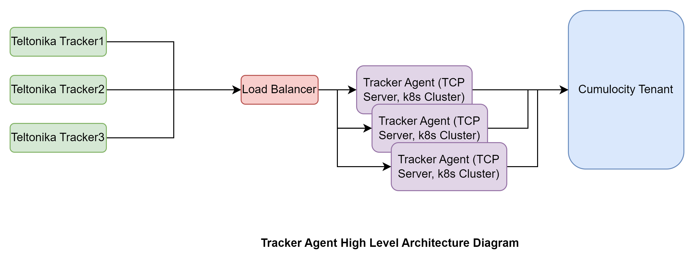
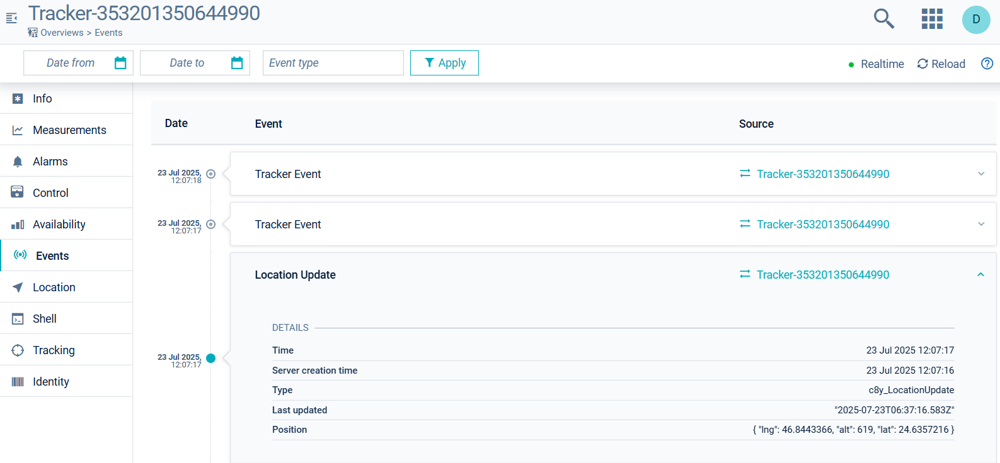
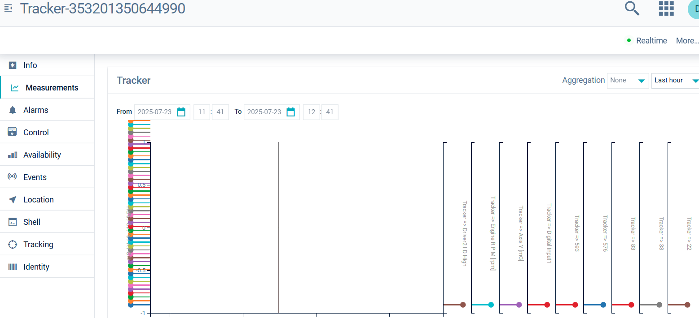

# Tracker TCP Agent Microservice

## Description

The [Tracker Agent](https://github.com/Cumulocity-IoT/Tracker-Agent) is a microservice designed to bridge the gap between Teltonika GPS trackers and the Cumulocity IoT platform. It enables seamless TCP-based communication, efficient data processing, and multi-tenant support, making it ideal for large-scale IoT deployments.

---

##  Why a Standalone TCP Agent?

Cumulocity IoT is a secure, cloud-native platform that prioritizes controlled connectivity. For devices that communicate over TCP—such as Teltonika trackers—a dedicated microservice is used to handle these connections. This TCP agent is deployed externally, typically on a Kubernetes cluster, and leverages a load balancer to efficiently manage and route incoming device traffic.

---

## Functionality Overview

- Tracker devices connect via TCP and send IMEI in CODEC 8 / 8E format.
- The agent checks for pending commands and sends them in Codec12 format.
- Command exchange occurs only after device identification (IMEI).
- Supports **bidirectional** communication with Cumulocity.



---

##  Communication Protocols

* **Device to Agent:** TCP protocol
* **Agent to Cumulocity:** HTTPS protocol

This setup ensures secure and efficient bidirectional communication between devices and the Cumulocity IoT platform.

---

##  How It Works

### 1. Connection Management

The agent maintains several in-memory maps to manage device connections and tenant information:

* **connectionRegistry:** Maps TCP connection IDs to device IMEI numbers and connection objects.
* **imeiToConn:** Maps device IMEI numbers to connection information, including Cumulocity device IDs and tenant IDs.
* **Tenants:** Lists all tenants subscribed to the microservice.

### 2. Device Registration validation

* Devices must be registered through Cumulocity’s built-in [registration interface](https://cumulocity.com/docs/device-management-application/registering-devices/), via the Cumulocity API, or using the [Cumulocity CLI](https://goc8ycli.netlify.app/docs/)

* Sample script to register the device in Cumulocity tenant - [Device registration script](https://github.com/Cumulocity-IoT/Tracker-Agent/blob/main/script/createDevice.sh). This script will run only if you have go c8y-cli installed in your machine and activated - [go-c8y-cli](https://goc8ycli.netlify.app/docs/)

* External Id type must always be `c8y_IMEI` while registering the device

Upon receiving an IMEI number from a device, the agent:

1. Checks the global registry for the device.
2. If not found, iterates through subscribed tenants to locate the device.
3. If still not found, logs an error indicating the device is not registered.

### 3. Supported Devices & Messaging Protocol
* Devices - `Teltonika` 
* Message Protocol - `CODEC8 / CODEC8E / CODEC12`

### 4. Data Processing

The agent processes data in Teltonika's Codec 8, 8E, and 12 formats:

* **Location Updates:** Converts GPS data into Cumulocity events and updates the device's position in the inventory.
* **Measurements:** Translates AVL properties into measurement values and inserts them into Cumulocity.
* **Events:** Generates events for specific Teltonika events received from the device.

### 5. Command Processing

When a device connects and sends its IMEI:

1. The agent retrieves any pending commands for the device.
2. Sends commands one at a time over the TCP connection.
3. Updates the operation status in Cumulocity to "EXECUTING" before sending and "SUCCESSFUL" after sending.

---

### 6.  Deployment Guide

#### Prerequisites

* **Cumulocity Tenant**: A Cumulocity Tenant
* **Java**: Version 21 or higher
* **Maven**: Version 3.6 or higher
* **WSL (Windows Subsystem for Linux)**: [Install WSL](https://learn.microsoft.com/en-us/windows/wsl/install#install-wsl-command) — required if you're using a non-Linux machine
* **Docker**: Install via [Docker with WSL integration](https://docs.docker.com/engine/install/debian/)
* **Kubernetes Cluster**:
  * For development/testing: [k3s](https://docs.k3s.io/quick-start)
  * For production: [k8s](https://kubernetes.io/docs/setup/)

> **Tip:** After installing `k3s`, create an alias for convenience:


```
alias kubectl='k3s kubectl'
```


#### Steps

1. **Clone Tracker agent repo:**
 Tracker Agent Git repository - [Tracker-Agent](https://github.com/Cumulocity-IoT/Tracker-Agent/tree/main)
```
git clone https://github.com/Cumulocity-IoT/Tracker-Agent.git
```
2. **Build the Microservice:**

```
cd {project root directory}
mvn clean install
```

3. **Build Docker Image:**

```
cd target/docker-work
docker build -t tcp-agent:1.0 .
```

4. **Save Docker Image:**

```
cd target/docker-work
docker save -o tcp-agent-image.tar tcp-agent:1.0
```
5. **Create the K3s images directory if it doesn't exist**
```
sudo mkdir -p /var/lib/rancher/k3s/agent/images/
```

6. **Copy Docker Image to k3s local registry:**

```
sudo cp tcp-agent-image.tar /var/lib/rancher/k3s/agent/images/
```

7. **Restart k3s:** - It will load image into k3s local registry
```
sudo systemctl restart k3s
```
8. **Validate docker image into local k3s Registry:**
```
sudo ctr -n k8s.io --address /run/k3s/containerd/containerd.sock images ls | grep tcp-agent
```
9. **Configure Cumulocity:**
  * Create and subscribe a dummy microservice (tcp-agent) on the enterprise tenant and subtenants - c8y API endpoint - [Create Application API](https://cumulocity.com/api/core/#operation/postApplicationCollectionResource)
   ```json
   {
	"apiVersion": "2",
	"version": "0.0.1",
    "availability": "MARKET",
    "type": "MICROSERVICE",
    "name": "tcp-agent",
    "key": "tcp-agent-key",
	"provider": {
		"name": "Cumulocity GmbH"
	},
	"isolation": "MULTI_TENANT",
	"resources": {
        "cpu": "1",
        "memory": "512M"
    },
	"requiredRoles": [
		"ROLE_INVENTORY_READ",
		"ROLE_INVENTORY_CREATE",
		"ROLE_INVENTORY_ADMIN",
		"ROLE_IDENTITY_READ",
		"ROLE_IDENTITY_ADMIN",
		"ROLE_AUDIT_READ",
		"ROLE_AUDIT_ADMIN",
		"ROLE_MEASUREMENT_READ",
		"ROLE_MEASUREMENT_ADMIN",
		"ROLE_EVENT_READ",
		"ROLE_EVENT_ADMIN",
		"ROLE_DEVICE_CONTROL_READ",
		"ROLE_DEVICE_CONTROL_ADMIN",
		"ROLE_APPLICATION_MANAGEMENT_READ",
		"ROLE_TENANT_MANAGEMENT_READ",
		"ROLE_OPTION_MANAGEMENT_READ",
		"ROLE_OPTION_MANAGEMENT_ADMIN"

	],
	"roles": [
	],
	"livenessProbe": {
		"httpGet": {
			"path": "/health",
			"port": 80
		},
		"initialDelaySeconds": 30,
		"periodSeconds": 10
	},
	"readinessProbe": {
		"httpGet": {
			"path": "/health",
			"port": 80
		},
		"initialDelaySeconds": 30,
		"periodSeconds": 10
	}
    } 
   ```
  * Subscribe the microservice to at least one tenant where you have registered your devices - c8y API to Microsubscribe a service on a tenant - [Subscribe Microservice to a tenant](https://cumulocity.com/api/core/#operation/postTenantApplicationReferenceCollectionResource)
  * Retrive the bootstrap credentials using c8y API endpoint - [Retrive Bootstrap User](https://cumulocity.com/api/core/#operation/getApplicationUserRepresentation)
  ```Json
  {
    "name": "servicebootstrap_tcp-agent",
    "password": "9IK31Y4zqnmgQqEC1JmMI1E95Cc7yi6j",
    "tenant": "t07007007"
  }
```
  * Populate bootstrap credentials in the deployment.yml file along with below values

```yml
stringData:
  C8Y_BOOTSTRAP_USER: "servicebootstrap_tcp-agent"
  C8Y_BOOTSTRAP_PASSWORD: "####################"
  C8Y_BASEURL: "https://yourtenant.eu-latest.cumulocity.com"
  C8Y_BOOTSTRAP_TENANT: "t2105"  #Tenant Id where this microservice hosted/ deployed
  C8Y_DEFAULT_TENANT:"t2105" #Tenant Id by default you will on-board your tracker devices
  C8Y_SUBSCRIBED_TENANTS: "t2105"  # List of tenant ids separated by comma where devices will be registered (add comma separated if more than one tenant)
  C8Y_MICROSERVICE_ISOLATION: "MULTI_TENANT"

```
```yml
containers:
      - name: c8y-tracker-agent
        image: docker.io/library/tcp-agent:1.0 #Replace this with your agent docker image 
```

10. **Deploy to Kubernetes:**

```
kubectl apply -f deployment.yml
```

11. **Validate k3s deployment pod:**

```
kubectl get pods
```

12. **Find your WSL Distro IP:**

```
wsl -d Debian hostname -I

172.31.27.28
```
13. **Connect to TCP port:**

```
telnet 172.31.27.28 30001 #k3s nodeport
```
Note - use this simulator to connect and publish the data from device to Cumulocity - [TCP - Simulator](https://github.com/Cumulocity-IoT/Tracker-Agent/blob/main/simulator/TrackerSimulator.py)

14. **Validate data in Cumulocity Tenant on the specific device:**

  


---

### 7. Example JSON Payloads

### Location Update Event

```
{
    "type": "c8y_LocationUpdate",
    "text": "Location Update",
    "source": {
        "id": "95147185373",
        "name": "Tracker 356307042441014"
    },
    "time": "2025-01-21T17:20:19.176+05:30",
    "c8y_Position": {
        "lng": 46.7399983,
        "alt": 614,
        "lat": 24.8425733
    }
}
```

### Teltonika Event

```
{
    "type": "Teltonika_Events",
    "text": "Teltonika Events",
    "source": {
        "id": "95147185373",
        "name": "Tracker 356307042441014"
    },
    "time": "2025-01-21T17:20:20.021+05:30",
    "Teltonika_Events": {
        "satellites": 17,
        "altitude": 614,
        "eventID": 0,
        "totalEvents": 21,
        "latitude": 248425733,
        "angle": 149,
        "priority": 0,
        "events": {
            "44": "0000",
            "EF": "01",
            "01": "01",
            "56": "FFFF",
            "68": "FFFF",
            "15": "04",
            "18": "000B",
            "19": "7FFF",
            "09": "00AE",
            "F0": "01",
            "6A": "FFFF",
            "F1": "0000A413",
            "1A": "7FFF",
            "B3": "00",
            "1B": "7FFF",
            "0B": "00000002183D5F1D",
            "0E": "0000000042F6A81D",
            "71": "64",
            "42": "34E6",
            "43": "1012",
            "10": "00270A38"
        },
        "speed": 11,
        "instant": 1733995551000,
        "longitude": 467399983
    },
    "raw_payload": "08120000019579AC9788001BD128570EA7A7E4029800ED120000000E06EF00F0001505C8004501010006B50009B600054231FE430FAF4400000900AE02F10000A41"
}
```

### Tracker Measurement Data
```
{
    "measurements": [
        {
            "type": "Tracker",
            "source": {
                "id": "30495470"
            },
            "time": "2025-04-09T15:30:44.678+05:30",
            "Tracker": {
                "24": {
                    "value": 93.0,
                    "unit": ""
                },
                "25": {
                    "value": 3000.0,
                    "unit": ""
                },
                "Movement": {
                    "value": 1.0,
                    "unit": ""
                },
                "26": {
                    "value": 3000.0,
                    "unit": ""
                },
                "27": {
                    "value": 3000.0,
                    "unit": ""
                },
                "Ignition": {
                    "value": 1.0,
                    "unit": ""
                },
                "241": {
                    "value": 42003.0,
                    "unit": ""
                },
                "DigitalInput": {
                    "value": 1.0,
                    "unit": ""
                },
                "179": {
                    "value": 0.0,
                    "unit": ""
                },
                "BatteryCurrent": {
                    "value": 0.0,
                    "unit": ""
                },
                "104": {
                    "value": 3000.0,
                    "unit": ""
                },
                "106": {
                    "value": 3000.0,
                    "unit": ""
                },
                "9": {
                    "value": 811.0,
                    "unit": ""
                },
                "86": {
                    "value": 3000.0,
                    "unit": ""
                },
                "GSMSignal": {
                    "value": 4.0,
                    "unit": "dB"
                }
            }
        }
    ]
}
```

---

### 8. Getting Started

1. **Deploy the microservice** on your Kubernetes cluster.
4. **Configure tenant options** in Cumulocity.
5. **Set up tracker devices** to connect via TCP to the agent.
6. **Monitor device connections and operations** within the Cumulocity platform.

---
### 9.  Git-Repository
[Tracker Agent on GitHub](https://github.com/Cumulocity-IoT/Tracker-Agent)

### 10.  Extending the Tracker Agent for Integration with Other Tracking Devices

* Clone the Tracker Agent repository from GitHub - [Tracker Agent on GitHub](https://github.com/Cumulocity-IoT/Tracker-Agent).

* Implement device-specific logic for encoding and decoding TCP messages.

* Add transformation logic to map decoded messages to the Cumulocity domain model and vice versa.

* Test your implementation thoroughly.

* Build and deploy the customized agent.

##  Contribution

Contributions are welcome! Please follow the standard pull request process and ensure all code changes are tested before submitting.